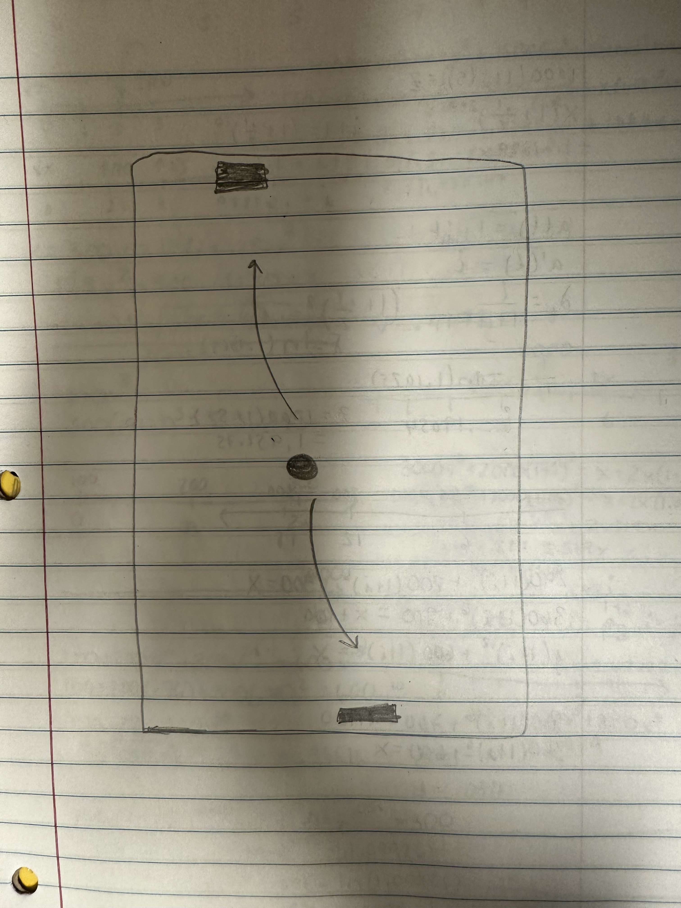
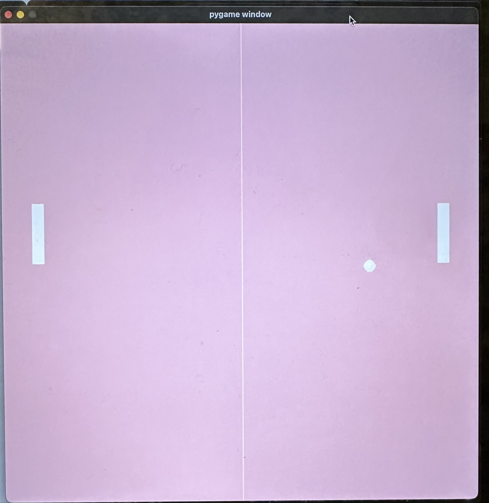

:warning: Everything between << >> needs to be replaced (remove << >> after replacing)

# << Project Title >>
## CS110 B1 Final Project  << Semester, Year >>

## Team Members

Sara Antin

***

## Project Description

It is going to simulate a ping pong game. both paddles are moveable by the player, for paddle 2, the player presses the up and down arrows to move up and down. and for paddle 1 the player presses the w and s keys to move up and down. the goal is to bounce the ball from pne paddle to the other. if player misses the game ends.

***    

## GUI Design

### Initial Design

### Final Design

## Program Design

### Features

1. start menu
2. moveable paddle
3. gameover screen
4. obstacle paddle
5. bouncing ball

### Classes

- ball class: it makes the ball that moves between the two paddles for the game. this is what is getting bounced. if the paddles miss the ball then the game ends
- paddle class: this creates the two paddles. the player controls both paddles and they play the game against themself by moving each paddle up and down to bounce the ball off of.
- controller class: this is where i imported the ball and paddle to in order to use them and make the game

## ATP

| Step                 |Procedure             |Expected Results                   |
|----------------------|:--------------------:|----------------------------------:|
|  1                   | Run Counter Program  |GUI window appears with count = 0  |
|  2                   | click count button   | display changes to count = 1      |
etc...
