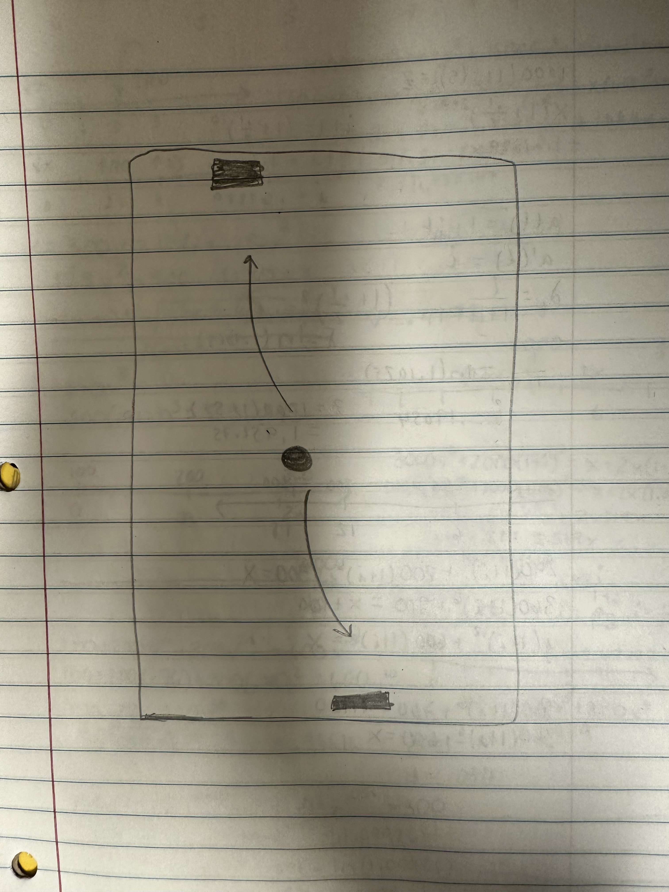

:warning: Everything between << >> needs to be replaced (remove << >> after replacing)

# << Project Title >>
## CS110 B1 Final Project  << Semester, Year >>

## Team Members

Sara Antin
***

## Project Description

It is going to simulate a ping pong game. One paddle is moveable by the player and the other is moveable by the computer. the goal is to bounce the ball from pne paddle to the other. if player misses the game ends.
***    

## GUI Design

### Initial Design

### Final Design

## Program Design

### Features

1. start menu
2. moveable paddle
3. gameover screen
4. obstacle paddle
5. bouncing ball

### Classes

- << You should have a list of each of your classes with a description >>

## ATP

| Step                 |Procedure             |Expected Results                   |
|----------------------|:--------------------:|----------------------------------:|
|  1                   | Run Counter Program  |GUI window appears with count = 0  |
|  2                   | click count button   | display changes to count = 1      |
etc...
